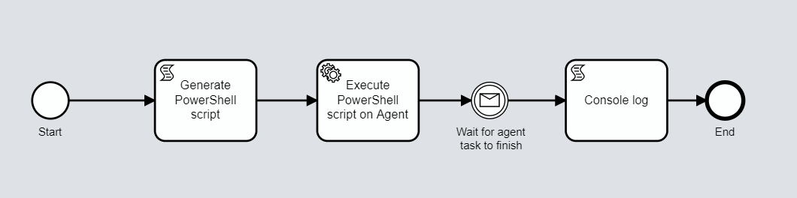

# Onify Blueprint: Flow and Agent invoke PowerShell script

Generate a PowerShell script and run it on a Onify Agent. A simple way to generate any type of script and then run it on any agent. The PowerShell script is generated using JavaScript :)

## Requirements

* Onify Hub API 2.3.0 or later
* Onify Flow license
* Camunda Modeler 4.4 or later 
* Onify Agent with PowerShell

## Included

* 1 x Resources (agent)
* 1 x Flows

## Setup

### Resources

1. Copy `InvokeScript.ps1` to Onify Agent scripts folder

### Flows

#### Deploy

1. Open `bpmn` in Camunda Modeler
2. Click `Deploy current diagram` and follow the steps

#### Run 

To test and run the flow, click `Start current diagram`

## Support

* Community/forum: https://support.onify.co/discuss
* Documentation: https://support.onify.co/docs
* Support and SLA: https://support.onify.co/docs/get-support

## License

This project is licensed under the MIT License - see the [LICENSE](LICENSE) file for details.
